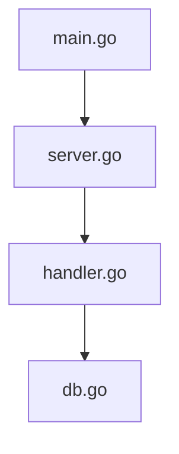

<p align="center">
  <h1 align="center">🗺️ Mapstr</h1>
  <p align="center">
    <strong>AI-Powered Codebase Navigator — Understand any project in seconds.</strong>
  </p>
  <p align="center">
    <a href="#-quick-start">Quick Start</a> •
    <a href="#-installation">Installation</a> •
    <a href="#-llm-providers">LLM Providers</a> •
    <a href="#-configuration">Configuration</a> •
    <a href="#-integrations">Integrations</a>
  </p>
  <p align="center">
    
    
    
    
  </p>
</p>

---

> **"Don't read the code. Map it."** 🧭

Mapstr is a **single-binary CLI** that analyzes any software project and generates a complete, human-readable map of the codebase — powered by structural parsing and multi-LLM summarization.

**One command. Three outputs. Any language. Any LLM.**

---

## ⚡ Quick Start

```bash
# 🔍 Analyze current directory (auto-detects your LLM provider)
$env:ANTHROPIC_API_KEY = "key"
mapstr -p Claude


# 🤖 Pick your AI provider
mapstr --provider claude
mapstr --provider openai --model gpt-4o
mapstr --provider gemini --model gemini-2.5-pro

# 🏠 Use a local model — fully offline, zero API costs
mapstr ./my-project --provider ollama --model llama3

# 🔧 Structural analysis only — no AI, no API calls
mapstr ./my-project --no-ai
```
## 🤖 LLM Providers

Mapstr works with **6+ LLM providers** out of the box. Just set your API key and go:

| Provider | Env Variable | Default Model | Best For |
|----------|-------------|---------------|----------|
| 🟣 Claude (Anthropic) | `ANTHROPIC_API_KEY` | `claude-sonnet-4-5` | Nuanced architecture summaries |
| 🟢 OpenAI | `OPENAI_API_KEY` | `gpt-4o` | Strong general performance |
| 🔵 Gemini (Google) | `GEMINI_API_KEY` | `gemini-2.5-pro` | Large context — great for monorepos |
| 🟡 DeepSeek | `DEEPSEEK_API_KEY` | `deepseek-chat` | Cost-effective reasoning |
| 🟠 Mistral | `MISTRAL_API_KEY` | `mistral-large-latest` | EU-hosted, strong multilingual |
| ⚫ Ollama (local) | — | `llama3` | Fully offline, zero cost, private |

### 🎬 What It Looks Like

```
  Analyzing my-project...

  ✓ Parsed 128 files
  ✓ Built graph: 441 nodes, 114 edges
  ✓ AI summary generated (mistral)

  ┌─────────────────────────────────────────────────────────────────┐
  │                                                                 │
  │  Analysis Complete!                                             │
  │                                                                 │
  │  ⏱  Duration : 3.2s                                            │
  │  💰 Cost     : $0.0008 (mistral)                               │
  │  📁 Outputs  : mapstr/ (CONTEXT.md, GRAPH.mmd, context.json)   │
  │  📊 Stats    : 128 files | 441 nodes | 114 edges               │
  │                                                                 │
  └─────────────────────────────────────────────────────────────────┘
```

> Animated spinners during each phase, real-time cost tracking from API usage, and a clean summary box on completion.

---

## 📦 Output

One command generates **three files** in `<project>/mapstr/`:

| File | Description |
|------|-------------|
| 📄 `mapstr/CONTEXT.md` | Natural-language architecture overview — written for humans |
| 📊 `mapstr/GRAPH.mmd` | Mermaid dependency diagram — visualize relationships at a glance |
| 🤖 `mapstr/context.json` | Structured data — optimized for AI assistants (Claude, Cursor, Copilot) |

<details>
<summary>📄 Example <code>CONTEXT.md</code> output</summary>

```markdown
# Project: my-api

## Overview
This project contains 42 files across 2 languages.

| Language   | Files |
|------------|-------|
| Go         | 30    |
| TypeScript | 12    |

## Architecture
- 87 functions/methods
- 15 types/classes
- 12 API routes
- 23 module dependencies

## Entry Points
- `cmd/server/main.go`
- `src/index.ts`

## API Routes
| Method | Path           | File              |
|--------|----------------|-------------------|
| GET    | /api/users     | handlers/user.go  |
| POST   | /api/users     | handlers/user.go  |
| GET    | /api/health    | handlers/health.go|
```

</details>

<details>
<summary>📊 Example <code>GRAPH.mmd</code> output</summary>



</details>

---

## 📥 Installation

Choose your preferred method:

### 🐹 Go

```bash
go install github.com/BATAHA22/mapstr@latest
```

### 🍺 Homebrew (macOS / Linux)

```bash
brew install BATAHA22/tap/mapstr
```

### 📦 Pre-built Binaries

Download from [**GitHub Releases**](https://github.com/BATAHA22/mapstr/releases):

| Platform | Architecture | Download |
|----------|-------------|----------|
| 🐧 Linux | amd64 / arm64 | `mapstr_linux_amd64.tar.gz` |
| 🍎 macOS | amd64 / arm64 (Apple Silicon) | `mapstr_darwin_arm64.tar.gz` |
| 🪟 Windows | amd64 | `mapstr_windows_amd64.zip` |

### 🐳 Docker

```bash
docker run --rm -v $(pwd):/app bataha22/mapstr /app
```

---

## 🌐 Supported Languages

| Language | Parser | Frameworks | Status |
|----------|--------|------------|--------|
| 🐹 Go | `go/parser` (stdlib AST) | net/http, Gin, Echo | ✅ Stable |
| 🟨 JavaScript | Regex-based extraction | Express, Next.js, React | ✅ Stable |
| 🔷 TypeScript | Regex-based extraction | Express, Next.js, React | ✅ Stable |
| 🐍 Python | Regex-based extraction | Django, FastAPI, Flask | ✅ Stable |
| 🎯 Dart | Regex-based extraction | Flutter | ✅ Stable |
| 🦀 Rust | — | — | 🔜 Planned |
| ☕ Java | — | — | 🔜 Planned |
| 💎 Ruby | — | — | 🔜 Planned |

> **What gets extracted:** functions, methods, classes, interfaces, types, enums, mixins, imports, exports, and API routes (Express, Flask, FastAPI, net/http, Flutter routes, etc.)

---


### 💰 Cost Tracking

Mapstr tracks token usage from every API call and estimates the cost in real time. After each analysis, the summary box shows the exact cost:

| Provider | Input (per 1M tokens) | Output (per 1M tokens) | Typical Analysis Cost |
|----------|----------------------|------------------------|----------------------|
| 🟣 Claude | $3.00 | $15.00 | ~$0.005 |
| 🟢 OpenAI | $2.50 | $10.00 | ~$0.004 |
| 🔵 Gemini | $1.25 | $5.00 | ~$0.002 |
| 🟡 DeepSeek | $0.14 | $0.28 | ~$0.0003 |
| 🟠 Mistral | $2.00 | $6.00 | ~$0.003 |
| ⚫ Ollama | Free | Free | $0.00 |

> Costs are estimated from actual `input_tokens` and `output_tokens` returned by each API. Use `--no-ai` for zero cost.

### 🔍 Auto-Detection

If no `--provider` flag is set, Mapstr automatically checks for API keys in the order above and uses the **first available provider**. No configuration needed — just set your key and run.

### 🛡️ Fallback System

If the primary provider fails, Mapstr gracefully falls back:

```
Primary provider → Fallback provider → --no-ai mode → never crashes
```

---

## ⚙️ Configuration

Create a `.mapstr.yml` in your project root for persistent settings:

```yaml
# 🌍 Output language (en, ar, es, fr, de, zh, ja, ...)
language: en

# 📦 Output formats to generate
output:
  - md        # CONTEXT.md
  - mermaid   # GRAPH.mmd
  - json      # context.json

# 🤖 AI provider settings
ai:
  provider: claude              # claude | openai | gemini | deepseek | mistral | ollama
  model: claude-sonnet-4-5      # Model name (uses provider default if omitted)
  fallback: ollama              # Fallback if primary fails
  no_ai: false                  # Set true for structural-only analysis

# 🔍 Analysis settings
depth: 3                        # How deep to traverse the dependency tree
incremental: true               # Only re-analyze changed files (git-aware)

# 🚫 Ignored paths (these are the defaults — override to customize)
ignore:
  - .git
  - node_modules
  - vendor
  - __pycache__
  - venv
  - .venv
  - env
  - dist
  - build
  - .next
  - .nuxt
  - __init__.py
  - manage.py
  - "*.min.js"
  - "*.min.css"
  - "*.lock"
  - "[0-9][0-9][0-9][0-9]_*.py"  # Django migrations
```

---

## 🚩 CLI Reference

```
Usage:
  mapstr [path] [flags]

Path is optional — defaults to the current directory.

Flags:
  -l, --lang string        🌍 Output language (default "en")
  -o, --output strings     📦 Output formats: md, mermaid, json (default: all)
  -p, --provider string    🤖 LLM provider: claude, openai, gemini, ollama, deepseek, mistral
  -m, --model string       🧠 Model name (uses provider default if not set)
      --no-ai              🔧 Skip LLM — structural analysis + graph only
  -d, --depth int          🔍 Dependency tree depth (default 3)
  -w, --watch              👀 Watch mode — regenerate on file changes
      --mcp                🔌 Start as MCP server for AI assistants
  -c, --config string      📄 Path to .mapstr.yml config file
      --out-dir string     📁 Output directory (default: <project>/mapstr/)
  -h, --help               ❓ Show help
  -v, --version            📌 Show version (ASCII art banner + author info)
```

### 💡 Usage Examples

```bash
# Analyze current directory — outputs to ./mapstr/
mapstr

# Analyze a project in Arabic
mapstr ./my-project --lang ar

# Generate only the Mermaid diagram
mapstr ./my-project --output mermaid --no-ai

# Use GPT-4o and output to a specific directory
mapstr ./api --provider openai --model gpt-4o --out-dir ./docs

# Analyze with DeepSeek for cost-effective summaries
mapstr ./large-monorepo --provider deepseek
```

---

## 🔌 Integrations

### 🧩 MCP Server (Claude Code / Cursor)

Run Mapstr as an MCP server so AI assistants can query your project structure on demand:

```json
{
  "mcpServers": {
    "mapstr": {
      "command": "mapstr",
      "args": ["--mcp"]
    }
  }
}
```

### 🔄 GitHub Actions

Auto-generate and commit `CONTEXT.md` on every push — documentation that never goes stale:

```yaml
- name: 🗺️ Generate Codebase Context
  uses: BATAHA22/mapstr-action@v1
  with:
    lang: en
    output: md
```

### 🪝 Git Hook (post-clone)

Automatically run Mapstr after every `git clone`:

```bash
git config --global init.templateDir ~/.git-templates
# Add mapstr to the post-checkout hook
```

---

## 🏗️ How It Works

```
📂 codebase
   │
   ▼
🔬 Language Parsers         Go / JS / TS / Python / Dart parsing        ← spinner animation
   │
   ▼
🔗 Dependency Resolver      Resolves imports, exports, cross-file refs
   │
   ▼
🕸️ Graph Builder            Builds relationship graph of modules         ← spinner animation
   │
   ▼
🤖 LLM Summarizer           Claude / OpenAI / Gemini / Ollama / ...     ← spinner + cost tracking
   │
   ▼
📦 Output Engine
   ├── 📄 CONTEXT.md         Architecture overview
   ├── 📊 GRAPH.mmd          Mermaid dependency diagram
   └── 🤖 context.json       Structured data for AI tools
   │
   ▼
🎉 Summary Box              Duration, cost, stats, output paths
```

### 🔑 Key Design Decisions

- **No CGo** — Pure Go + regex parsers for JS/Python. Single static binary, easy cross-compilation.
- **No Tree-sitter dependency** — Go's stdlib `go/parser` for Go files, battle-tested regex for JS/TS/Python/Dart.
- **Provider-agnostic** — Unified `Provider` interface. Add a new LLM in ~50 lines.
- **Real-time cost tracking** — Token usage parsed from every API response. Know exactly what each analysis costs.
- **Incremental analysis** — Git-aware caching. Only re-parses changed files.
- **Graceful degradation** — If AI fails, you still get the structural analysis and graph.
- **Professional CLI UX** — Animated spinners, colored output, and a completion summary box.

---

## 🆚 Comparison

| Feature | Mapstr | Repomix | CodePrism |
|---------|--------|---------|-----------|
| 🤖 Multi-LLM support (6+) | ✅ | ❌ | ❌ |
| 🔧 Offline / no-AI mode | ✅ | ❌ | ❌ |
| 📊 Visual Mermaid graph | ✅ | ❌ | ⚠️ Complex |
| 💰 Cost tracking (per-request) | ✅ | ❌ | ❌ |
| 🎬 Animated CLI (spinners, colors) | ✅ | ❌ | ❌ |
| 🌍 Multi-language summaries (i18n) | ✅ | ❌ | ❌ |
| 📦 Single binary CLI | ✅ (Go) | ✅ (Node) | ❌ (Rust) |
| 👨‍💻 Built for developers | ✅ | ❌ | ❌ |
| 🔌 MCP Server | ✅ | ❌ | ✅ |
| 🔄 GitHub App | ✅ | ❌ | ❌ |
| ⚡ Incremental (git-aware) | ✅ | ❌ | ❌ |

---

## 🗺️ Roadmap

- [ ] 🖥️ **Interactive TUI** — Navigable dependency graph in the terminal
- [ ] 🔀 **PR Context** — Auto-generate context diffs for pull requests
- [ ] 👥 **Team Mode** — Shared context maps with annotations
- [x] 🎯 **Dart/Flutter** — Full Dart parser with Flutter route detection
- [x] 🧠 **Framework-Aware** — Smart ignore for Django, Next.js, Go vendor
- [x] 🎬 **Professional CLI UX** — Spinner animations, colored output, summary box
- [x] 💰 **Cost Tracking** — Real-time token usage and cost estimation per provider
- [ ] 🔌 **Plugin System** — Custom analyzers for frameworks (React, Django, Rails)
- [ ] 🧬 **Embedding Export** — Vector embeddings for RAG pipelines
- [ ] 📊 **Provider Benchmarks** — Compare summary quality across LLMs
- [ ] 🌐 **Custom Endpoints** — Support any OpenAI-compatible API (vLLM, LMStudio)
- [ ] 🦀 **More Languages** — Rust, Java, C#, Ruby, PHP

---

## 🤝 Contributing

Contributions are welcome! Here's how to get started:

```bash
# Clone the repo
git clone https://github.com/BATAHA22/mapstr.git
cd mapstr

# Install dependencies
go mod tidy

# Run tests
go test ./...

# Build (dev version)
go build -o mapstr .

# Build with version from git tag
go build -ldflags "-X github.com/BATAHA22/mapstr/cmd.Version=$(git describe --tags --abbrev=0)" -o mapstr .

# Run on itself 🤯
./mapstr . --no-ai
```

---

## 📄 License

MIT — Free and open source, forever.

---

<p align="center">
  <strong>🗺️ "Don't read the code. Map it."</strong>
  <br><br>
  <a href="https://github.com/BATAHA22/mapstr">⭐ Star on GitHub</a> •
  <a href="https://github.com/BATAHA22/mapstr/issues">🐛 Report Bug</a> •
  <a href="https://github.com/BATAHA22/mapstr/issues">💡 Request Feature</a>
</p>
